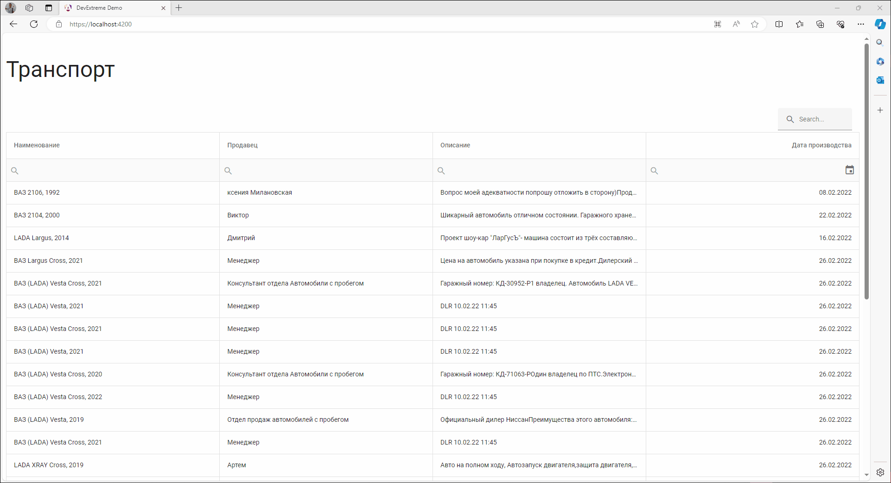

# Таблица транспортных средств с поиском по году

В данном проекте представлена таблица транспортных средств с возможностью поиска по году. Для создания пользовательского интерфейса (UI) используется библиотека DevExtreme.

Для просмотра демонстрации и использования таблицы, вы можете перейти по ссылке ниже:
[Демо таблицы транспортных средств DevExtreme](https://js.devexpress.com/Angular/Demos/WidgetsGallery/Demo/DataGrid/Overview/MaterialBlueLight/)

TODO:
 - Ограничить длину текстового поля "описание"(cDescription) при составлении запроса. Тк тип nvarchar(max) позволяет хранить большой текст
 - Вынести connection string в файл настроек appsettings, либо использовать виртуальные переменные среды окружения(dotenv)
 - Добавить индексы на поля в sql(например для быстрого поиска по дате)
 - фронтенд: локализация, вынести грид в отдельный компонент и тд

